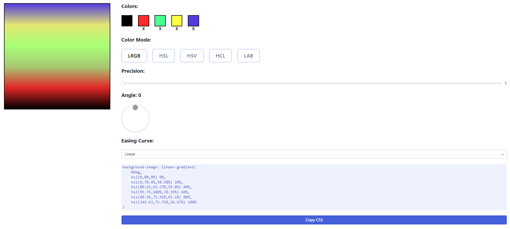

# Linear-Gradient-Generator
Build a simple linear gradient generator web application.


## Tasks
Build a simple Gradient color generator application (https://www.joshwcomeau.com/gradient-generator/)

- User should be able to set up to 5 base colors
- User should be able to switch between LRGB, HSL, HSV, HCL, LAV color modes
- User should be able to set Precision using Slider
- User should be able to set Angle value
- User should be able to set Easing Curve (Linear, Ease, Fun)
- User should be able to see the generated gradient color
- User should be able to copy the CSS to clipboard
- Custom color selection component that is similar to sample
- Custom Angle component that is similar to sample

## Environment
- Windows 11
- Node v16.20.2
- Npm 8.19.4

## Tech stacks
- Vite + React + Typescript
- Radix UI
- Tailwind CSS

## Steps to run program
1. Install node modules
   ```shell
   npm install
   ```

2. Run project
   ```shell
   npm run dev
   ```
This will host the project on http://localhost:3000.